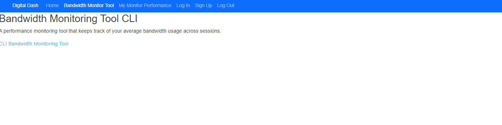
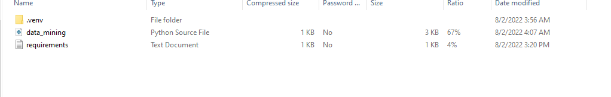

# Installation

## CLI Tool

* By installing the zip file, Users are downloading a script
  that has the ability to measure their internet data speeds.
  * 

* After downloading the tool, Users will open the script file == "data_mining" == .
  * 

